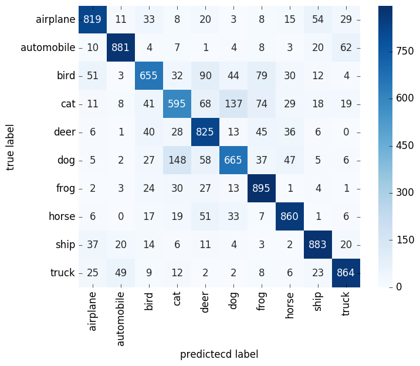

# Training a Classifier with Chainer: CIFAR10

## Usage

### Setup

``` bash
$ pip3 install pipenv
$ cd /path/to/chainer-cifar10
$ pipenv install
$ pipenv shell
```

### Training

``` bash
$ python train_classification.py
```

### Evaluation

``` bash
$ python eval_classification.py
```

## Training Results


## Evaluation Results 



## License

* MIT
